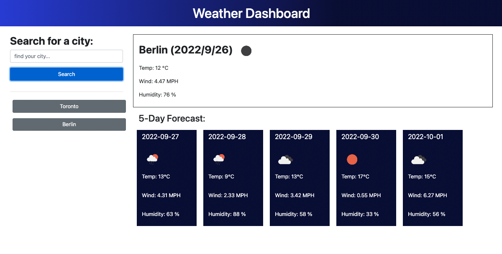

# Weather-Dashboard

## Table of Contents

- Description
- Technologies Used
- Usage
- Deployment
- Demo

## Description

Use this site to search the weather conditions for any city in the world. Get up-to-date information on current weather conditions, and forecasted conditions for the week ahead. Past search results will automatically save so you can revisit your searches to see continued up-to-date data.

### User Story

```
AS A traveler
I WANT to see the weather outlook for multiple cities
SO THAT I can plan a trip accordingly
```

### Acceptance Criteria

```
GIVEN a weather dashboard with form inputs
WHEN I search for a city
THEN I am presented with current and future conditions for that city and that city is added to the search history
WHEN I view current weather conditions for that city
THEN I am presented with the city name, the date, an icon representation of weather conditions, the temperature, the humidity, and the wind speed
WHEN I view future weather conditions for that city
THEN I am presented with a 5-day forecast that displays the date, an icon representation of weather conditions, the temperature, the wind speed, and the humidity
WHEN I click on a city in the search history
THEN I am again presented with current and future conditions for that city
```

## Technologies Used:

- HTML
- CSS
- JavaScript
- jQuery
- Bootstrap
- Open Weather API | Current Weather Data & 5 Day Weather forecast

## Usage:

Get up-to-date weather data on any city in the world - including currentt weather conditions, as well as forecasted weather for 5-days ahead. Search your city in the search bar to see your weather forecast. Past search results will be saved for easy access.

## Deployment:

View this application in a web enviroment: [https://amywilford.github.io/Weather-Dashboard/]

## Demo:


